### Flight System

At the core of any ship, the flight system within the game is extremely configurable. The play may access the "patch panel" of any flight system, to extend and change through upgrades.

The play may purchase off-the-shelve flight units (such as a quad stabilizer) to _plug in_. They may plug in the software/hardware package manually, opting to install and configure by hand.

The software level consists of a mass graph of "wire to component" connections. Each wire must be configured correctly.

> Fundamentally a player access the electronic circuits of the ship and mess around with anything. In game actions (rewiring) reflects within the software connection graph. (read the circuit docs for more)

As an analogy of any TV program with a ship; Futurama, Star Trek, or Red Dwarf - and imagine the ability to _run around_ the ship and futz with everything. It's my ship I can do what I want.

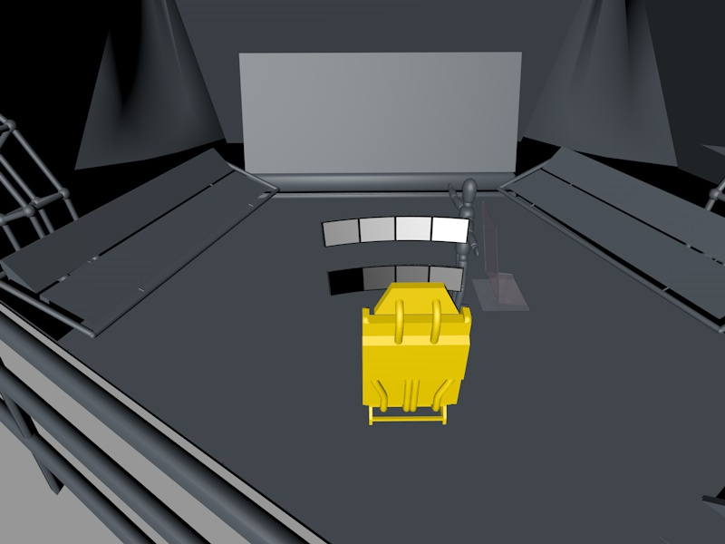

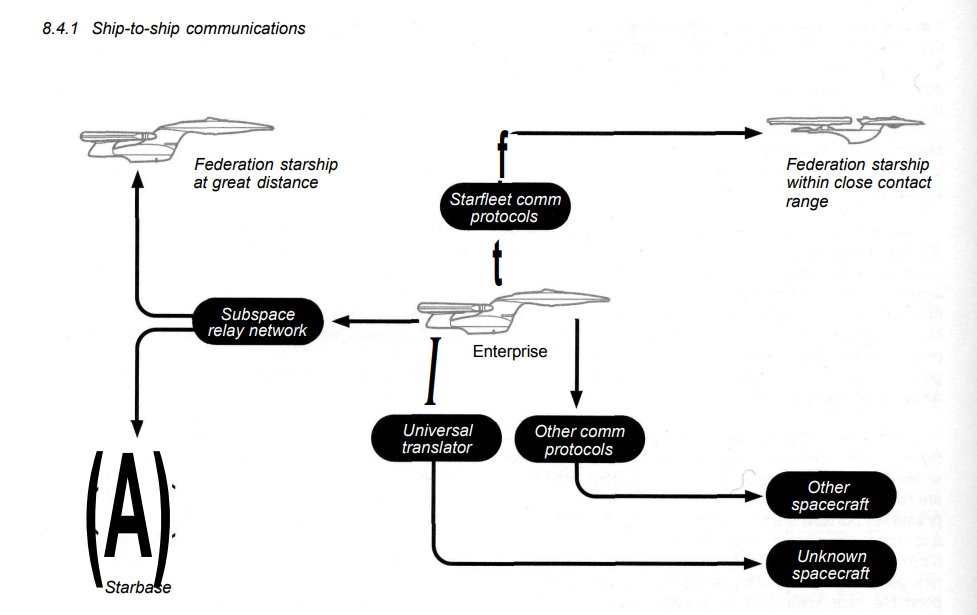

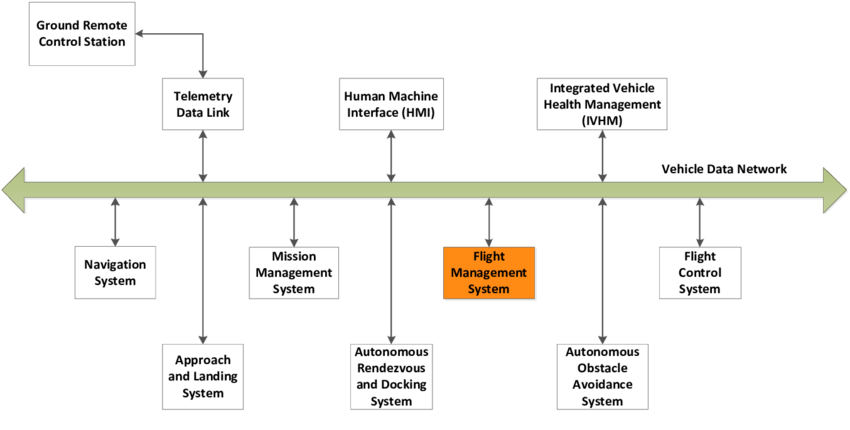

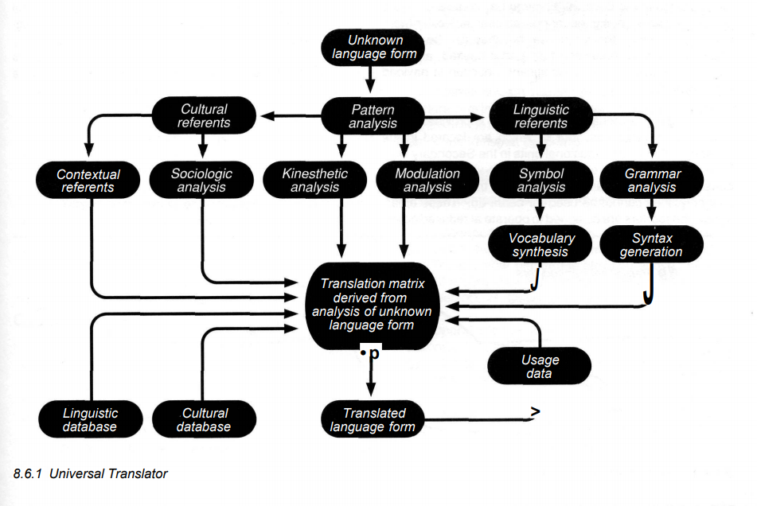

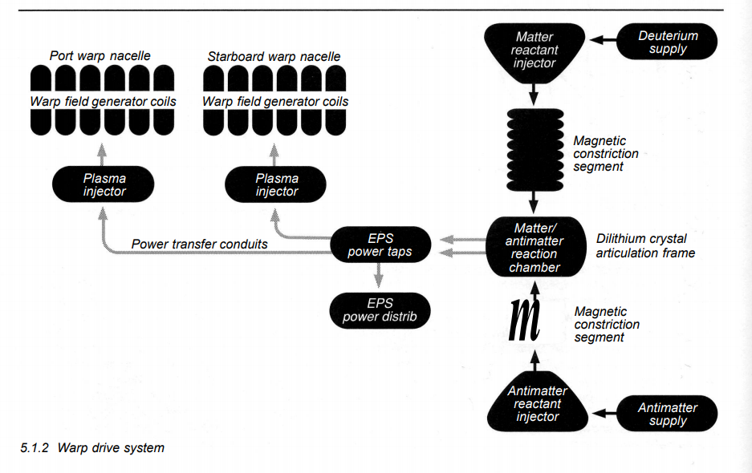

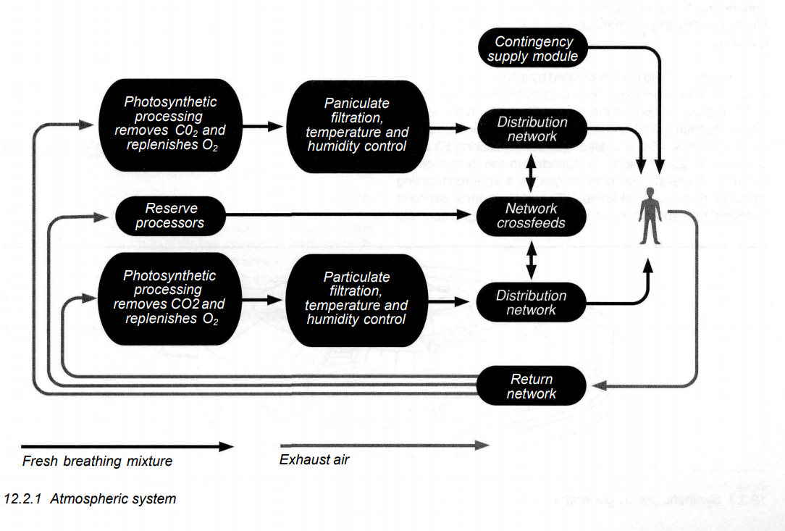

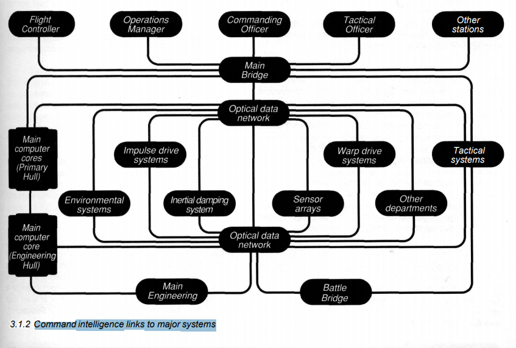

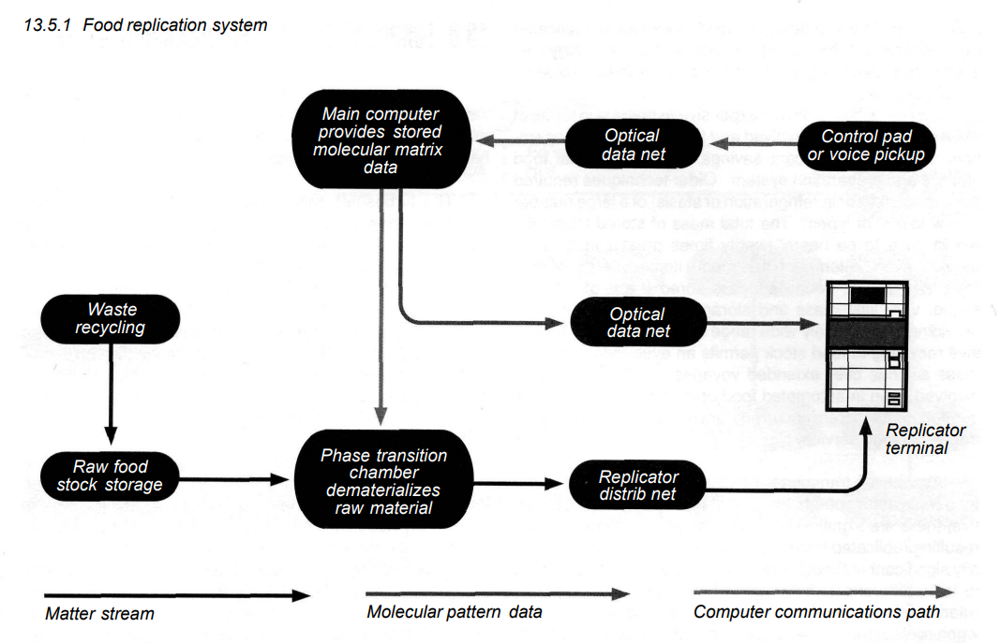

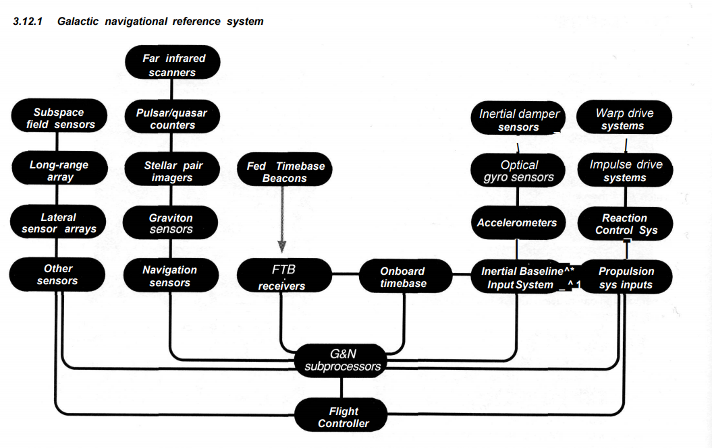

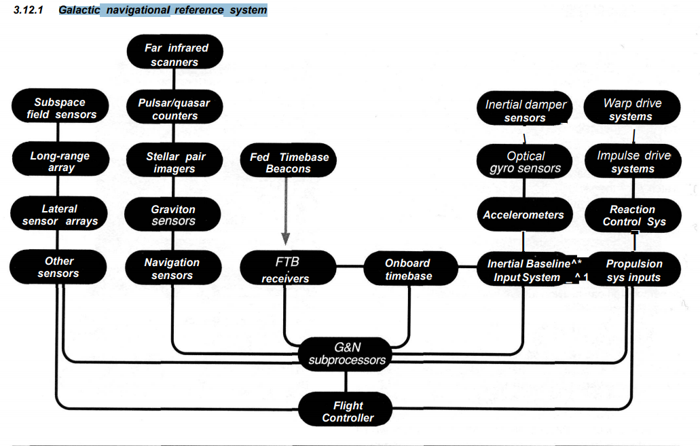

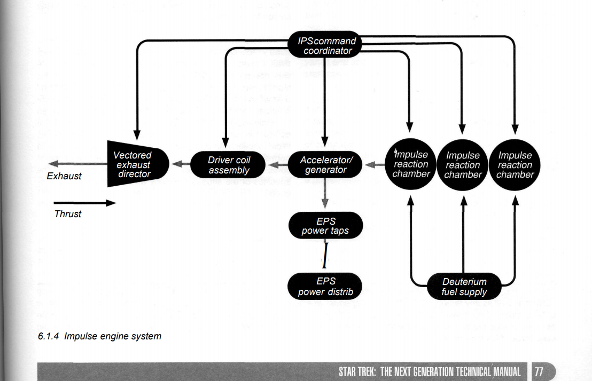

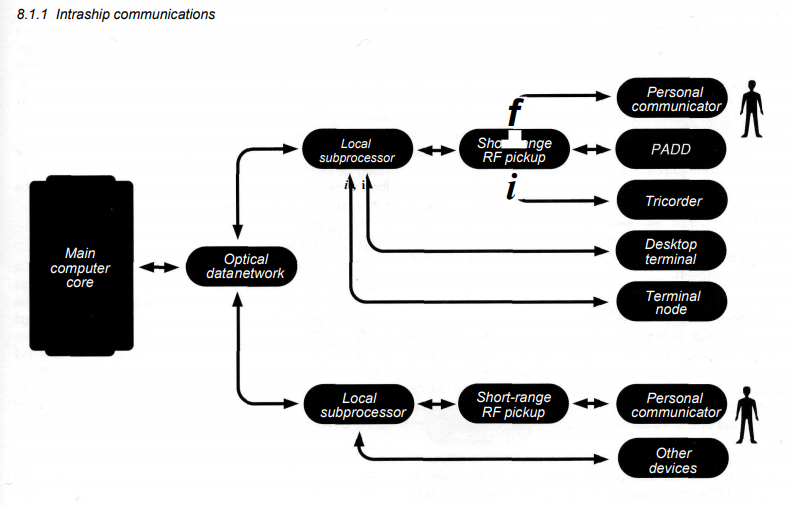

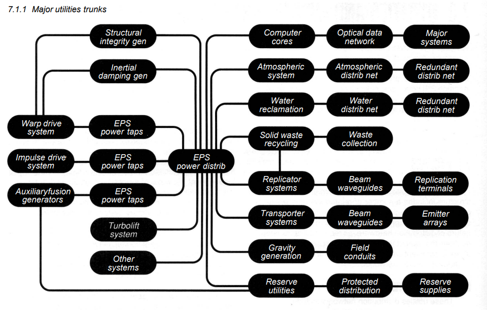

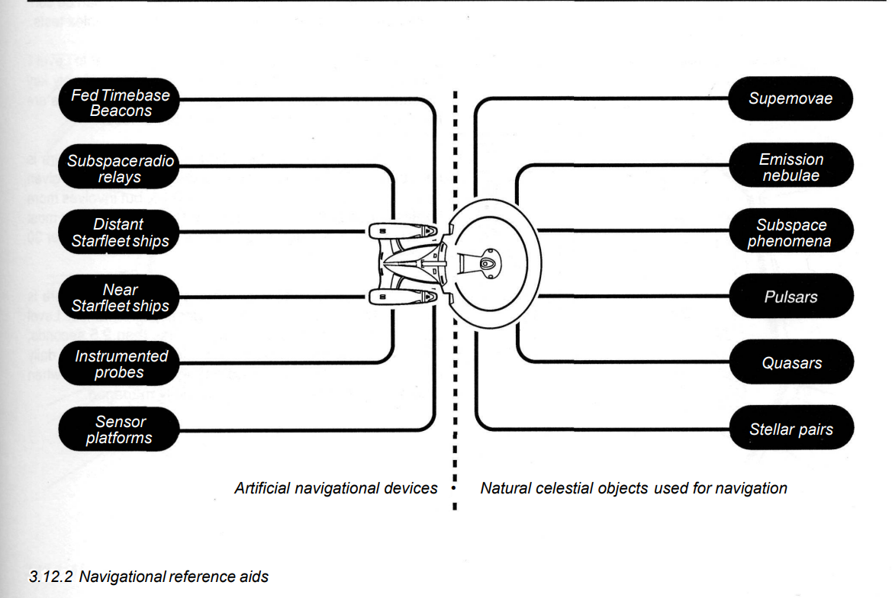

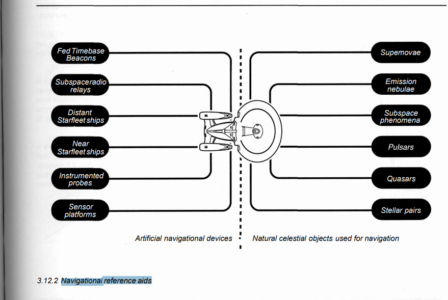

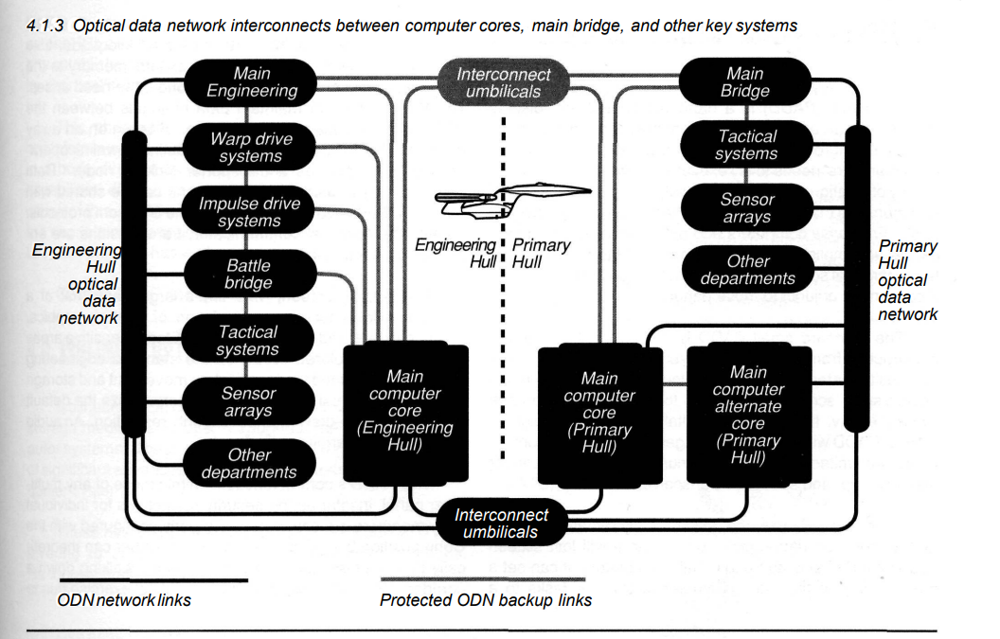

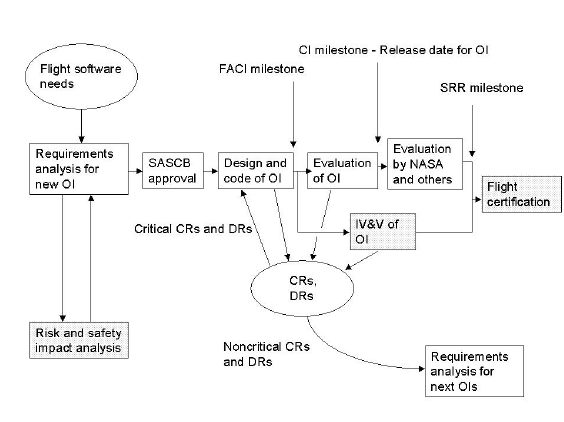

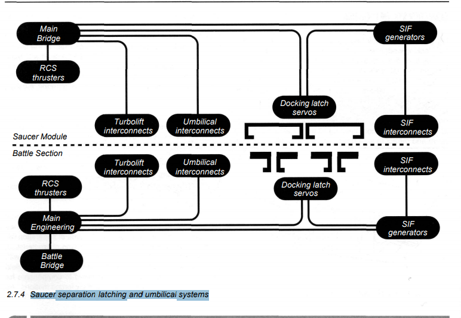

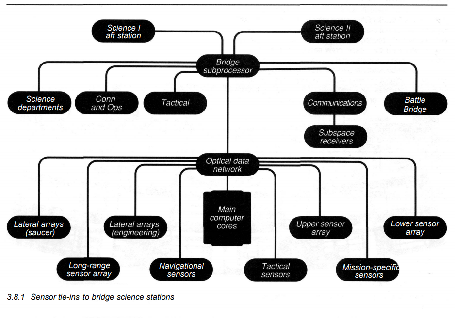