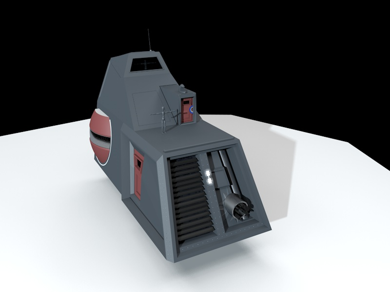

# Game: "It's my ship!"

At the moment the game has no name, fully playable interface, or any solid structure for a _game type_. However I do have a handle of the core game-play:

1. The game is a "futuristic flight sim" with a user customised ship
2. A player will gradually build upon a base ship design with game enhancements
3. The ship is 'configurable' to the very core; from ship layout to wire configurations.
4. Components have cross compatibility; such as a 'metal floor plate' as junkyard wiring.

## Some core concepts

Fundamentally this game is a flight-sim, but for custom buildouts. Much like "Kerbal Space Program" style buildouts - but with a fantasy twist to include "hovering engines"  of a futuristic utopia world in a timeline where _ion engines_ (and other anti gravity tech) is as ubiquitous as the wheel.

The user will own the device, and build upon its internal components in a general improvements system, The player has access to all _ship systems_ to manipulate for their own perfect system. Given a _base type_, a player can extend the internals with anything they find within game -

Here's an example of a _"Lando Cruiser"_ (box style) hovering freighter. The player may assume the role of a heavy goods courier:

