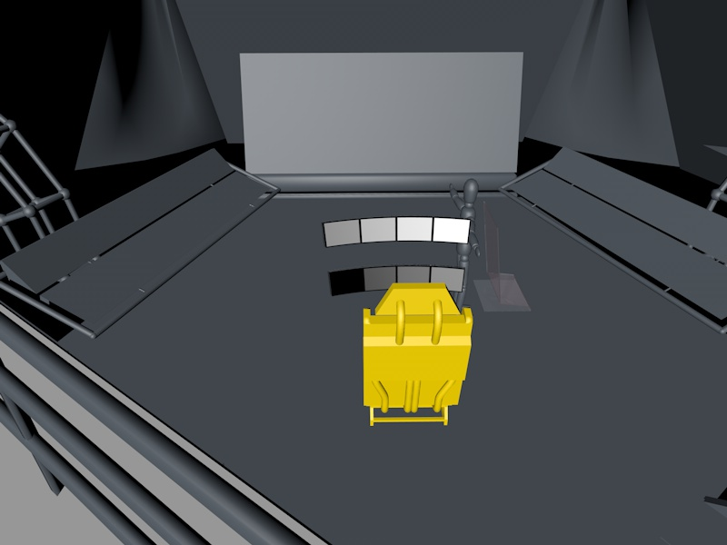

# Vehicles and Ships

Ideas and possibilities:

+ Red Dwarf Ship
+ Dr Who (not the tardis) in game ships (e.g Gridlock’s Flying Motorhomes or  "The beasts below" - Hover city)
+ Futurama style ship (plural)
+ Rigid Air Ships (2.0)
+ Jestons Bubble Ships
+ Star Trek 'run-abouts'
+ Hovering "Cranes" and build yard construction machines

These ships note unique styles and abilities for flying vehicles and the game engine can mimic these kinds. All vehicle designs need a _name_ and a design lore:

1. In 1940 Polosa Ensolore Fripslon discovered the Anti ion....
2. In 1952 the first hovering car by Old Corp
3. In 1960 New Corp invented 3vector

And so on, A design layout for each new company, in-keeping with the standard car manfacturing style

+ Some organic style ships

+ Freighters and long distance

+ 2 vector/4vector/22vector engine setups.

+ The "One Corp Everyone 1.0" generic style vehicle.

---

In game _small_ personal ships, allowing the player 2/3 decks of internal space. The idea is to mimic real water yacht, with a bridge, captains area, crew quarters etc.To apply this to an ingame fantasy, The _passenger ferries_ could huge airships with the ability to walk into the "balloon" (In this case it would be a huge hidden ion engine.)

---

The original idea of the game was a "red dwarf" style ship with many things to fix, however attempting to design a ship of this size by hand is not possible, and procedural generation is another large task.

As such a single ship with smaller workloads and a personal story line to drive the users upgrades.

---

The core concept is _the ship_ and the player should own as much as possible. the game functionality PoC presented the ability to:

+ Create a 'core' flyable unit, using rigid body 'Thrusters'
+ Dynamic appliance of the thrusters with a programmable power system
+ Tested up to 20+ engines on one ship works great.

With these features, it's extremely easy to hammer together _ship shapes_ to fly. Given there is a 'spaceship kit-bash' a user can component build their ship with pre-build rigid body components, and custom "flight system".

