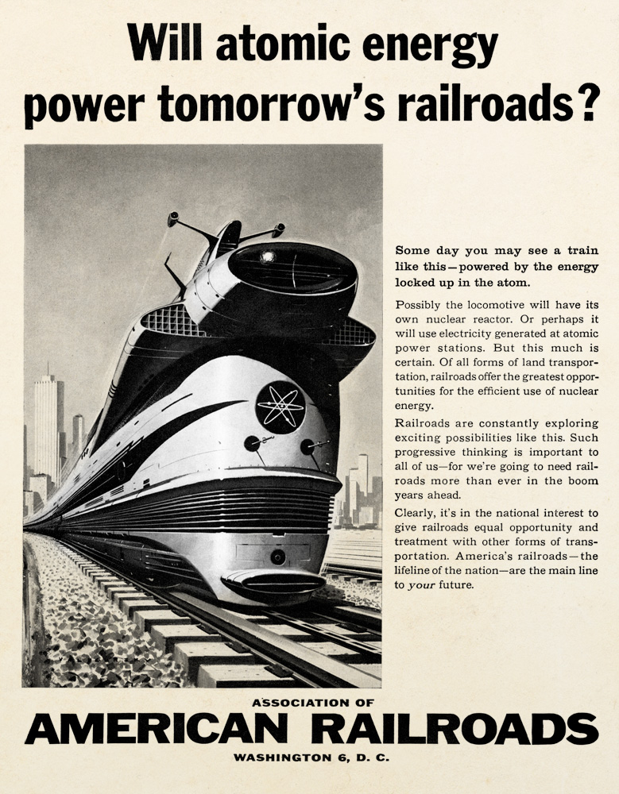
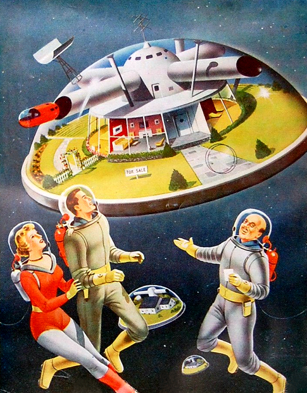

## User interface

### Visuals

The actual finished design/styles of the game is undecided - mostly focusing on the mechanics of the ship. I already understand how the "ship system" and 3D frontend will connect, allowing the designed assets to live separately of the ship system. Next is to decide on the best _look_ how user interaction.

Firstly a futuristic look to the game with the exception can handle most items (such as a single light bulb). A favourite style is "Atompunk" and "Solarpunk". In a similar vein to the famous Cyber and Steam punk, Atompunk focuses on a vision _after the atom_ is a utopia. This degrees slightly from "solarpunk", of which envisions a similar aesthetic with more trees (A focus on sustainability).

Frankly I love Atompunk and it's easier to design and render. A perfect example is "The Jetsons". All game aspects would map to a _Jetsons Universe_.

+ http://www.theastonishingadventures.com/atompunk/
+ [Google Image Search for atompunk imagery](https://www.google.com/imgres?imgurl=https%3A%2F%2Fsteampunkopera.files.wordpress.com%2F2014%2F07%2Fr1.jpg%3Fw%3D584%26h%3D425&imgrefurl=https%3A%2F%2Fforums.spacebattles.com%2Fthreads%2Fwhat-punk-punk-world-would-you-want-to-visit-reborn-live-in.816206%2F&tbnid=Wu6lBbCwqnfkLM&vet=12ahUKEwjf7dfOqr3zAhUZFBoKHZdJBEcQMyhKegQIARBn..i&docid=nkXGpVJshF6P0M&w=584&h=426&itg=1&q=Formicapunk&ved=2ahUKEwjf7dfOqr3zAhUZFBoKHZdJBEcQMyhKegQIARBn)
+ [Image reault for stealpunk](https://www.google.com/imgres?imgurl=https%3A%2F%2Fsteampunkopera.files.wordpress.com%2F2014%2F07%2Fr1.jpg%3Fw%3D584%26h%3D425&imgrefurl=https%3A%2F%2Fforums.spacebattles.com%2Fthreads%2Fwhat-punk-punk-world-would-you-want-to-visit-reborn-live-in.816206%2F&tbnid=Wu6lBbCwqnfkLM&vet=12ahUKEwjf7dfOqr3zAhUZFBoKHZdJBEcQMyhKegQIARBn..i&docid=nkXGpVJshF6P0M&w=584&h=426&itg=1&q=Formicapunk&ved=2ahUKEwjf7dfOqr3zAhUZFBoKHZdJBEcQMyhKegQIARBn#imgrc=Wu6lBbCwqnfkLM&imgdii=WxOB6Lih1AG3WM)

#### Atompunk:

+ https://aesthetics.fandom.com/wiki/Atompunk

Stylistically the Atompunk style entails:

+ Slightly oversaturated _happy_ colours
+ Suburban bubble homing and tall spires

With a focus on "Googie" Architecture:

And art by "Robert T McCall":

# Inspiration

