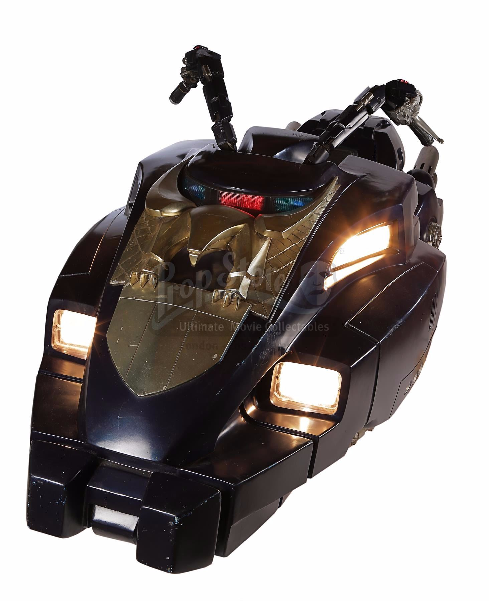
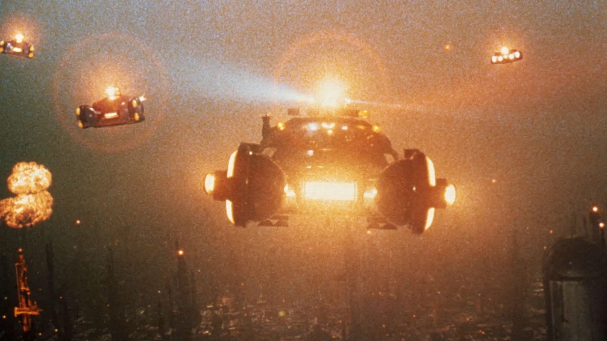
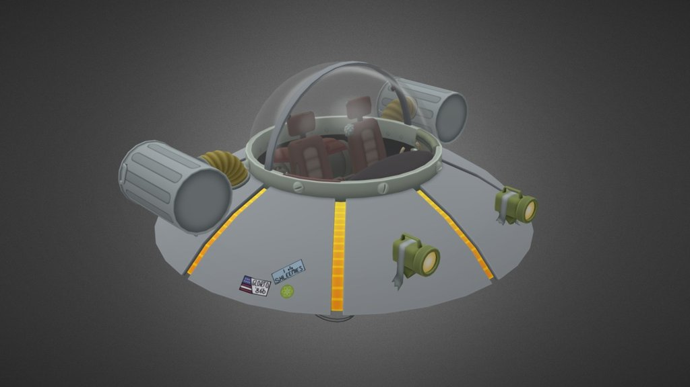
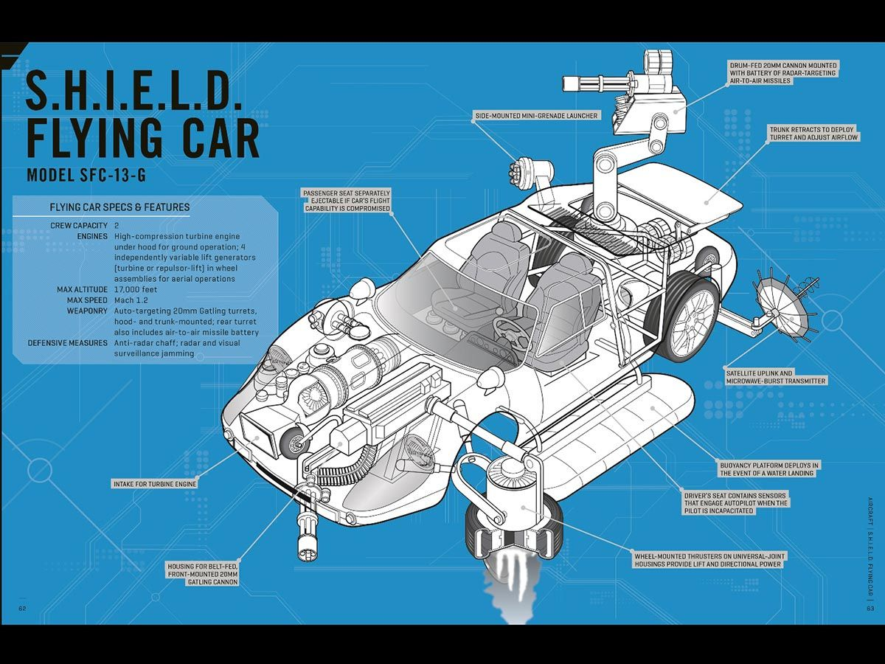
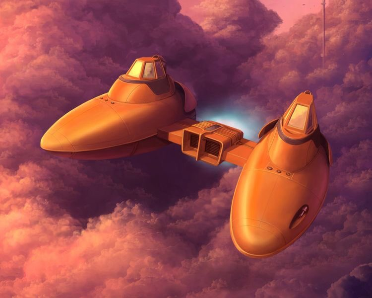
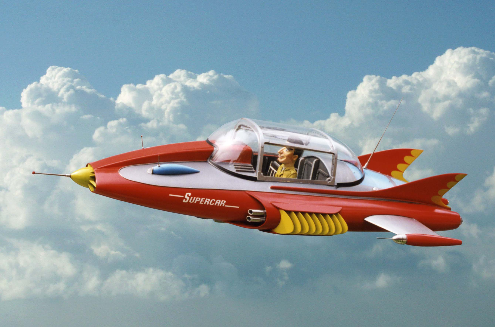
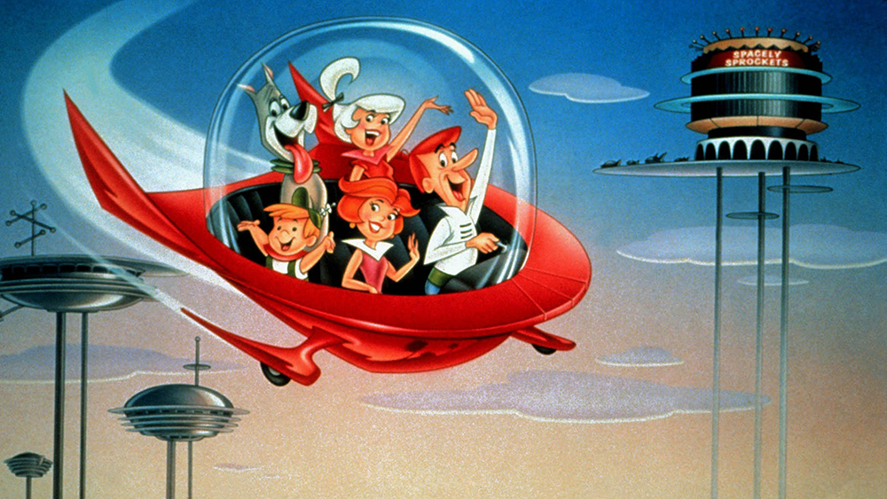
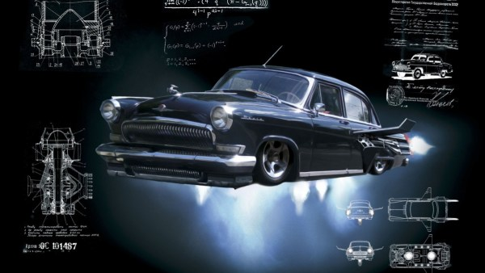
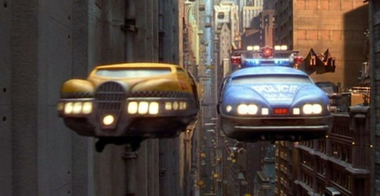

# Other Vehicles

Other machinery from movies as inspiration to the type of structures the game engine can produce. All vehicles have a general shape, a count of engines and their configuration (articulation/power etc.)

Blade Runner Hover bike:

+ 2 engines pointing down
+ The front vector rotates left/right
+ The rear vector aligns forward/reverse thrust

A Blade runner police car, with four 3 vector engines and a box shape

A "Rick and Morty Flying Saucer". A small 1 engine omni-directional (3 vectors) and 2 rear vector thrusts. (Pinhead style balance)

A "standard" S.H.I.E.L.D flying car, with rocket engine converting wheels and a turret.

A Star wars "Twinpod" for two person flying

A famous Caracter from the 50s/60s "SuperCar", presenfing an excellent sky car.

A star wars "Land Cruiser" as seen in the movies

A Jestons Hover Car, with the focus on style

Black Lighting? Is a famous car, converted to a jet powered flying vehicle with 4 _down_ vectors and one read vector. Each engine is fixed with variable power for turning

Another Favorite style; Fifth Element Hovering cars, offering a 2 engine "Stablised" positioning, and car-like motion.

